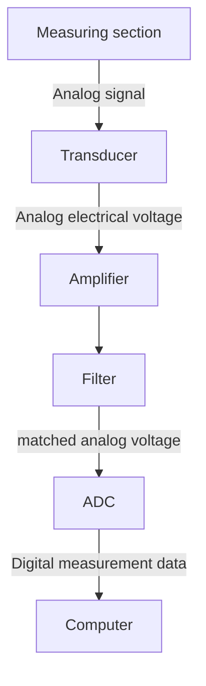

## Intro
- Measuring means to determine a quantity to be measured as a multiple of a generally recognized unit quantity of the same physical dimension. This is done by experimental comparison with a dimensional embodiment of this unit. 
- The comparison takes place within a measurement chain, at the end of which the result of the measurement is available in computer-readable form. 
- Amplifiers and filters are used to minimize the measurement errors.

## Components

#### Measuring section (Messstrecke)
Part of the measured object within which the measured value is influenced by the reaction of the measuring device. In the case of a direct measurement, the comparison process takes place in the measuring section (e.g. beam balance); in the case of an indirect measurement, the comparison takes place later in the measuring chain.

#### Transducer
It converts the physical quantity such as temperature, pressure, strain, motion, brightness, etc. Into an analog measurement signal, which is transmitted in the form of an electrical voltage ( or current ). The relationship between the measurand and the voltage is called the transfer function of the sensor. This should be reversibly unique, but does not necessarily have to be linear.

#### Amplifier
Matches the voltage range to the voltage range of the ADC. The amplification $V$ should be selected so that the ==maximum occurring voltage value analogous to the measurand is equal to the maximum input voltage== $U_{MAX}$ of the ADC. ($V=U_{MAX}$). The measurement error in the amplitude $x$ of the physical quantity is then minimal, since $V - Error(x) \approx U_{MAX} / 2 N$ ( for an N-bit ADC ), that is $Error (x) \approx 1 / V$ ( "minimizing the error in amplitude space" ).

#### Filter
It is used in the acquisition of time-dependent signals to change the frequency response of the measurement signal in such a way that transmission errors are minimized. In particular, the problem of the so-called **alias frequencies** should be eliminated ( see later ). Filter and amplifier are often integrated in one device.

#### ADC
It converts the voltage into a digitally represented number. All the limitations of the digital computer apply, in particular there is a smallest and a largest number as well as a finite smallest difference between two numbers, which helps to determine the measurement error ( see also discussion of resolution, differential and integral linearity of the ADC ). The difference between the original analog signal and the amplitude quantized signal leads to a so-called quantization noise ( error in amplitude space ).

## Acquisition of signals

#### Time dependent signals acquisition
To acquire a time-dependent signal, the amplitude of the signal should be sampled at regular intervals that are as short as possible.

**Important parameters**
- Conversion Time $t_C$ : Time for the conversion of the voltage into a number. Values between $10 ms$ and $5 ns$. 
- Aperture Time $t_A$ : Time in which the signal should be kept as constant as possible (generally $t_A$ << $t_C$ ). 
- Often the signal is buffered in a "sample-and-hold" circuit (analog). Sampling rate $f_{S}$ : Frequency at which the ADC can perform measurements. Obviously, $f_{S} < 1/t_{C}$

## Time and amplitude quantization

#### Amplitude quantization
![[Pasted image 20221202182102.png]]
(red is noise) (do python graph if have time) we can only sample between a few amplitude states (steps so higher or lower than the actual measured value)

#### Time quantization
![[Pasted image 20221202182336.png]]
The fact that we sample at a certain frequency means we have error... find more if time

## [[Nyquist theorem]]
How much information about the original signal is lost during sampling? ( Amplitude quantization is neglected here ) The answer must obviously depend on the level of the sampling frequency and on the shape of the signal

The answer is provided by the Nyquist sampling theorem:
- NO information is lost if the sampling frequency is greater than or equal to  twice the maximum frequency contained in the original signal $f_{MAX}$ ( corresponding to a Fourier decomposition of the signal ): 
$$f_{s}\geq2f_{max}$$
- If the sampling frequency is chosen too low, i.e. $f_{s}<2f_{max}$  then so-called Alias frequencies: the original frequency $f$ is "mirrored" to the alias frequency $f_S-f$. 
- The frequency $$f_{MAX} = f_S /2$$ is also called Nyquist frequency

## [[Alias frequencies]]
![[Pasted image 20221202182938.png]]
- Once a signal has been read into the computer, it is no longer possible to tell whether it is aliased or at the correct frequency. There are two ways to remedy this: 
	- The sampling frequency is increased until the Nyquist condition is fulfilled. 
	- The input signal is filtered with a low-pass filter so that all frequency components above $f_S /2$ are suppressed. This is the function of the "alias frequency filter" in the measurement chain. 
- To check whether a frequency component in the digitized signal is real or comes from an alias frequency, you can repeat the measurement at a different sampling frequency $f_{S2}$ as a trick. The real frequencies remain fixed, while the alias frequencies are shifted to the new value $f_{S2} - f$.

## [[Transient recorder]]
![[Pasted image 20221202183101.png]]